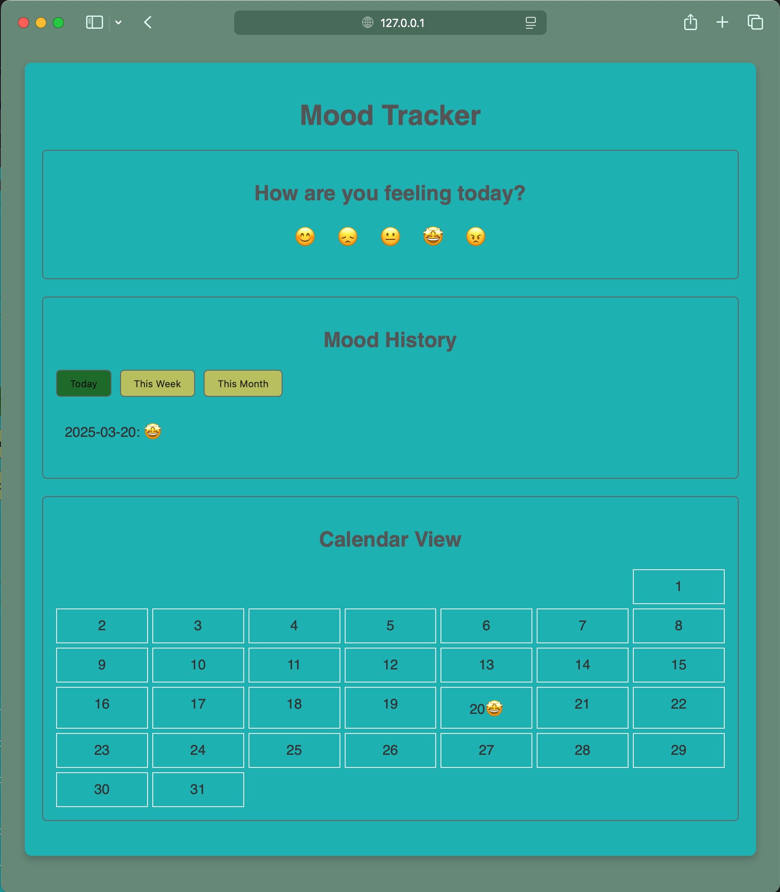
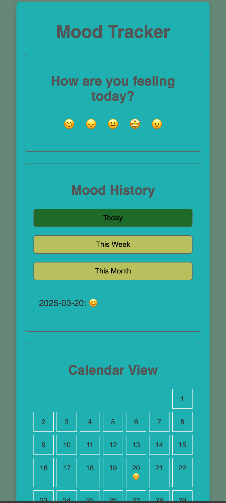
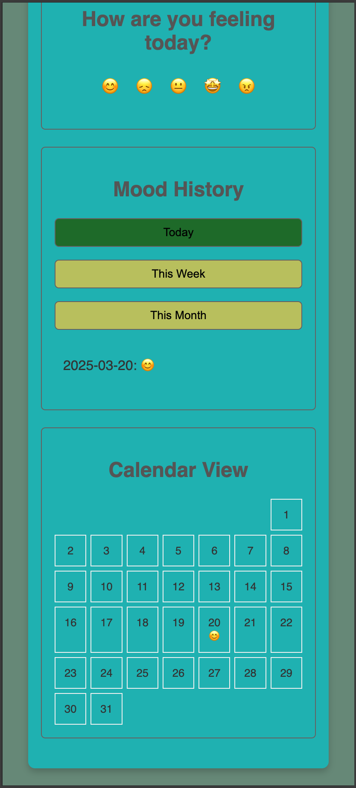

# Mood Tracker

A simple web application for tracking daily moods and visualizing emotional patterns over time.

## Live link
[Click here](https://meek-longma-1963ae.netlify.app/)

## 🚀 Images

### Desktop View


### Mobile View



## ✨ Features

- 😊 **Daily Mood Logging:** Choose from 5 mood emojis
- 📊 **Multiple Views:** 
  - Daily view
  - Weekly summary
  - Monthly overview
- 📅 **Calendar Visualization:** See moods mapped on a monthly calendar
- 💾 **Local Storage:** Private data storage in browser
- 📱 **Responsive Design:** Works on desktop and mobile devices

## 🛠️ Installation

1. Clone the repository:
```bash
git clone https://github.com/suuumans/mood-tracker.git
cd mood-tracker
```

2. Open in browser:
```bash
open index.html  # For Mac
```

## 💻 Technical Stack

- HTML5
- CSS3 (with Responsive Design)
- Vanilla JavaScript
- Local Storage API

## 🔒 Privacy

All mood data is stored locally in your browser using LocalStorage. No data is sent to any server.

## 🧪 Testing

Manual testing performed across:
- Chrome (latest)
- Firefox (latest)
- Safari (latest)
- Mobile responsive testing

## 🎯 Future Enhancements

- [ ] Data export/import functionality
- [ ] Additional mood options
- [ ] Custom notes for each mood entry
- [ ] Advanced mood analytics
- [ ] Previous/Next month navigation
- [ ] User accounts & cloud sync
- [ ] PWA support

## 🤝 Contributing

Contributions are welcome! Please feel free to submit a Pull Request.

## 📝 License

[MIT]

## 👤 Author

**Suman Sarkar**
[@suuumans](https://twitter.com/suuumans)